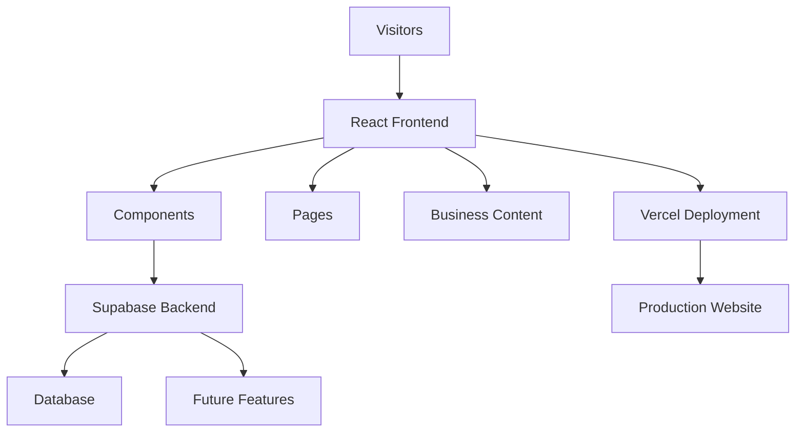

# 🎨 Panthi Craft

### Crafting Tradition Into a Modern Digital Experience

A professional, responsive, and production-ready business website designed to help local artisans and craft businesses establish a strong online presence, showcase their products, and connect with customers worldwide.

<a href="https://panthi-craft.vercel.app/">🌐 Live Demo</a> • <a href="https://github.com/AvadhKalathiya/panthi-craft">📂 Repository</a> • <a href="https://github.com/AvadhKalathiya">👨‍💻 Developer</a>

---

# 📖 About The Project

In today's digital-first world, many local businesses struggle to establish a strong online identity. Traditional craft businesses often rely solely on offline customers, limiting their growth potential and market reach.

**Panthi Craft** was developed to bridge this gap by providing a modern, elegant, and highly responsive web platform that helps businesses showcase their products professionally while delivering an exceptional user experience across all devices.

The project focuses on:

✅ Professional Brand Presentation

✅ Product Visibility Enhancement

✅ Customer Engagement

✅ Mobile-First Experience

✅ High Performance & Accessibility

✅ Scalable Architecture

✅ Production-Ready Deployment

---

# 🎯 Business Objectives

| Objective                 | Impact                         |
| ------------------------- | ------------------------------ |
| Establish Online Presence | Increase brand visibility      |
| Showcase Products         | Improve product discovery      |
| Mobile Accessibility      | Reach customers on all devices |
| Fast Performance          | Improve user retention         |
| Professional Design       | Increase customer trust        |
| Future Scalability        | Enable long-term growth        |

---

# ✨ Key Features

### 🎨 Professional UI & UX

* Modern and elegant interface
* Clean visual hierarchy
* User-focused navigation
* Consistent branding

### 📱 Fully Responsive Design

* Mobile Friendly
* Tablet Optimized
* Desktop Ready
* Cross-Browser Compatible

### ⚡ Performance Optimized

* Fast Initial Load
* Optimized Assets
* Efficient Rendering
* Production Build Optimization

### 🛍 Product Showcase

* Structured Product Layout
* Easy Browsing Experience
* Clear Product Presentation
* Business-Oriented Design

### 🔒 Reliable Infrastructure

* Supabase Integration
* Secure Data Handling
* Production Deployment
* Scalable Foundation

### 🚀 Modern Development Practices

* Component-Based Architecture
* Reusable Code Structure
* Git Version Control
* Continuous Deployment

---

# 🛠 Technology Stack

## Frontend

| Technology | Purpose           |
| ---------- | ----------------- |
| React.js   | UI Development    |
| Vite       | Build Tool        |
| JavaScript | Application Logic |
| HTML5      | Markup Structure  |
| CSS3       | Styling           |

## Backend & Services

| Technology           | Purpose          |
| -------------------- | ---------------- |
| Supabase             | Backend Services |
| Database             | Data Storage     |
| Authentication Ready | Future Expansion |

## Deployment

| Technology | Purpose              |
| ---------- | -------------------- |
| Vercel     | Hosting & Deployment |

## Development Tools

| Tool    | Purpose                 |
| ------- | ----------------------- |
| Git     | Version Control         |
| GitHub  | Repository Management   |
| VS Code | Development Environment |

---

# 🏗 System Architecture

### Architecture Overview

The application follows a modern frontend architecture using React and Vite. User interactions are handled through reusable components, while backend services are managed through Supabase. Deployment is automated through Vercel, ensuring high availability and fast global delivery.

---

# 📈 Business Impact

## 🌍 Increased Visibility

Customers can discover products and services online from anywhere.

## 🤝 Improved Trust

A professional digital presence increases brand credibility.

## 📱 Better User Experience

Responsive design ensures smooth interaction across all devices.

## 🚀 Growth Opportunities

Creates a strong foundation for future marketing and e-commerce expansion.

## 🏆 Competitive Advantage

Helps local businesses compete effectively in the digital marketplace.

---

# 🏆 Project Highlights

✔ Real Client-Oriented Project

✔ Production Deployment

✔ Modern React Architecture

✔ Responsive Design

✔ Business-Focused Development

✔ Scalability Ready

✔ Performance Optimized

✔ Portfolio Grade Project

✔ Open Source Repository

✔ Professional UI/UX

---

# 👨‍💻 Developer

## Avadh Kalathiya

Final-Year Computer Science Engineering Student & Full Stack Developer passionate about building real-world software products that solve practical business problems.

### Connect With Me

🔗 GitHub: https://github.com/AvadhKalathiya

🔗 LinkedIn: https://linkedin.com/in/avadh-kalathiya

🌐 Portfolio: Add Portfolio URL

📧 Email: [avadhkalathiya219@gmail.com](mailto:avadhkalathiya219@gmail.com)

---

# 💖 Support The Project

If you find this project useful:

⭐ Star the repository

🍴 Fork the project

📢 Share it with others

🐛 Report issues

💡 Suggest new features

---

# 📜 License

This project is licensed under the MIT License.

---

## 🚀 Built with Passion by Avadh Kalathiya

### Transforming Ideas Into Real-World Digital Solutions

⭐ If you like this project, please consider giving it a star.

💙 Happy Coding!

